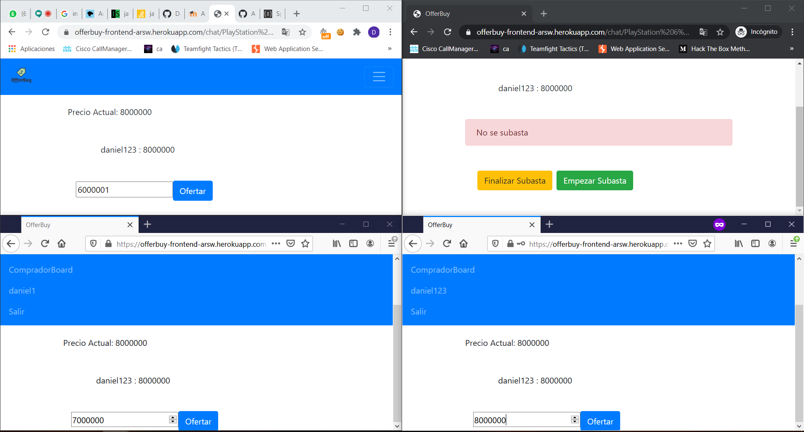

# Offer-Buy
## Autor: Daniel Felipe Alfonso Bueno 
## Arquitectura de Software
Es una nueva plataforma, de facturación electrónica donde usuarios vendedores podrán comercializar sus productos y compradores interesados podrán consultar un catalogo de productos, también los usuarios compradores podrán participar en subastas por algunos productos, que los vendedores iniciaran.  

### Aplicación desplegada 
[OfferBuy](https://offerbuy-frontend-arsw.herokuapp.com/login)

### Uso de la Aplicación

Contamos con un formulario de registro en el cual podemos elegir el rol de comprador o vendedor, creamos nuestro usuario.

Iniciamos sesión con nuestro usuario obtenemos un aviso de sesión correcta o error al iniciar. 

Nos redirige a un perfil donde encontramos el nombre de usuario y el email como datos importantes.

Podemos observar en el local storage el token que obtenemos del servidor 

En la vista de comprador board nos encontraremos con la lista de vendedores registrado y podremos ver su información y los productos que comercializan

En la vista de productos en la barra de navegación encontramos todos los productos registrados en nuestra aplicación y aqui podremos añadir 
productos a nuestro carrito de compras y entrar a una subasta.

Con el boton en la parte superior, podremos ver nuestro carrito de compras

Tenemos nuestro carrito de compras con los productos añadidos 

Ahora entramos desde un perfil de vendedor

En el board del vendedor podremos observar un botón de añadir productos, una vez los añadamos 

En esta pantalla del vendedor además de añadir mas productos, podremos editar los existentes de este vendedor. También podremos eliminar los productos y iniciar una subasta de un producto si damos en subasta nos llevara a la siguiente vista 

Una vez damos click en subasta desde la vista del vendedor aparecen unos botones para iniciar o finalizar la subasta

Desde la vista de comprador, basta con acceder desde la pagina de los productos buscamos el producto y hasta que el vendedor no de click en iniciar subasta no se habilitara el boton de ofertar

Como vemos entramos desde varios clientes y podremos ver que se habilita la barra de ofertar y podremos empezar a realizar ofertas 

El vendedor podra finalizar la subasta cuando lo desee 

Cuando se finalice la subasta se notifica a todos los usuarios participantes en esta quien fue el ganador. 

## Diseño 
## Diagrama de Componentes 

#### Jwt Authentication
En la aplicación se implemento Json web token como medida de seguridad donde los usuarios primero se registran desde el cliente a un endPoint 
en el servidor con un nombre de usuario contraseña rol, se procede a revisar en la base de datos para verificar que el registro no exista aún.     
Al momento de registro se procede a cifrar la contraseña con Bcrypt

- WebSecurityConfigurerAdapter Es el configurador de nuestra implementación de seguridad. Proporciona HttpSecurity configuraciones para configurar cors, csrf, administración de sesión, reglas para recursos protegidos. También podemos ampliar y personalizar la configuración predeterminada que contiene los siguientes elementos.

- la UserDetailsServiceinterfaz tiene un método para cargar Usuario por nombre de usuario y devuelve un UserDetails objeto que Spring Security puede usar para autenticación y validación.

- UserDetailscontiene la información necesaria (como: nombre de usuario, contraseña, autoridades) para construir un objeto de autenticación.

- UsernamePasswordAuthenticationTokenobtiene {nombre de usuario, contraseña} de la Solicitud de inicio de sesión, AuthenticationManagerlo usará para autenticar una cuenta de inicio de sesión.

- AuthenticationManagertiene un DaoAuthenticationProvider(con ayuda de UserDetailsService& PasswordEncoder) para validar el UsernamePasswordAuthenticationTokenobjeto. Si tiene éxito, AuthenticationManagerdevuelve un objeto de autenticación completamente poblado (incluidas las autoridades otorgadas).

- OncePerRequestFilter realiza una única ejecución para cada solicitud a nuestra API. Proporciona un doFilterInternal() método que implementaremos analizando y validando JWT, cargando los detalles del Usuario (usando UserDetailsService), verificando Autorización (usando UsernamePasswordAuthenticationToken).

Al momento de realizar un login mediante un username y password hacemos una solicitud a una APIREST el servidor crea un JWT con un secreto que otorgamos en la configuración envía una respuesta JWT (es decir el token, información del usuario, los roles) Después de esto el cliente nuevamente solicita al servidor el acceso a los recursos mediante las cabeceras. El servidor revisa la firma y las cabeceras y según los roles que tenga, devuelve el contenido al que está autorizado  

## Diagrama de Clases

